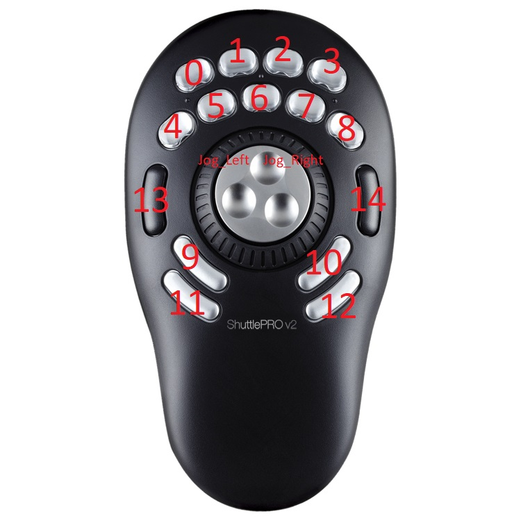

# LightroomShuttlePro
Lightroom plugin for support contour design ShuttlePro v2

The idea of the plugin is based on the following features:
1. Combination of Shuttle keys pressed support like on keyboard: Hold one button and press another. Each combination could be assigned with different Lightroom action.
2. Key combinations will also be possible with the Jog:
   - Hold one Shuttle key and rotate Jog – for example: loop through basic adjustment parameters (Temp, Exposure, Clarity, …)
   - Hold another Shuttle key and rotate Jog – some other actions
3. Multiple actions per combination and layout (key assignment) switching:
Press Shuttle key (or Combination) and Lightroom will be switched to Develop module. Shuttle layout will be changed to Development layout.

Video Demo: https://www.youtube.com/watch?v=26Smzy6-b_0&t=118s

## FUNCTIONALITY

TBD
- [x] Key Combination
- [x] Cycle through settings 
- [x] Rating
- [x] Basic Adjustment
- [ ] Zoom
- [ ] Crop
- [ ] Rotate

## PREREQUISITES
1. Have Shuttle Driver installed from: https://www.contourdesign.com/support/drivers/

## INSTALLATION

1. Put "ShuttlePlugin.lrplugin" directory to Lightroom plugin directory, by default it is: c:\Users\<UserName>\AppData\Roaming\Adobe\Lightroom\Modules\ShuttlePlugin.lrplugin\

## CONFIGURATION

Shuttle keys action assignment is done in [commandKeyToAction.xml](ShuttlePlugin.lrplugin/commandKeyToAction.xml) file.
Configuration supports multiple layouts. [commandKeyToAction.xml](ShuttlePlugin.lrplugin/commandKeyToAction.xml) provides two layouts by default: Library and Develop.
Switching between layouts is done by pressing the following key combination (configured by [commandKeyToAction.xml](ShuttlePlugin.lrplugin/commandKeyToAction.xml) file and could be adjusted, key numbers could be found on ShuttlePROv2_keys.jpg picture): 

Button_9+Button_7 -> Library

Button_9+Button_8 -> Develop

- Key Combination is specified with "+": *Button_9+Button_7* means: press and hold *Button_9*, than press and release *Button_7*
- Change layout: ShuttleSwitchProfile = Develop/Library
- Rating. Rating is set by number: rating = X
- Navigation by photo: select = next/previous
- Switch Lightroom mode: SwitchToModule = develop/library
- Select Develop parameter: SwitchBasicAdjustParam = -/+
- Change value for selected Develop parameter: ActiveDevelopParam = -/+

TBD: provide full description of commandKeyToAction.xml file format

## USAGE:

1. Start Lightroom
2. Use Shuttle as configured by commandKeyToAction.xml

### Default functionality:
By default Library layout is activated.
- Library layout default keys:
  - Button_4 ... Button_8 - set Rating from 1 to 5 
  - Jog_Left/Jog_Right - select photo Previous/Next
  - Button_9+Button_7 - switch layout and Lightroom to Library
  - Button_9+Button_8 - switch layout and Lightroom to Develop
- Develop layout default keys:
  - Button_9+Jog_Left/Jog_Right - select Basic Adjust parameter in loop:
    - Temperature
    - Tint
    - Exposure
    - Contrast
    - Highlights
    - Shadows
    - Whites
    - Blacks
    - Clarity
    - Vibrance
    - Saturation
  - Button_10+Jog_Left/Jog_Right - select Details Adjust parameter in loop:
    - Sharpness
    - SharpenRadius
    - SharpenDetail
    - SharpenEdgeMasking
    - LuminanceSmoothing
    - LuminanceNoiseReductionDetail
    - LuminanceNoiseReductionContrast
    - ColorNoiseReduction
    - ColorNoiseReductionDetail
    - ColorNoiseReductionSmoothness
  - Jog_Left/Right - decrease/increase selected Adjust parameter

